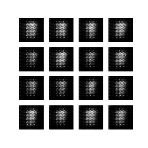

### MNIST GAN

This code is taken from the Tensorflow GAN Tutorial.

The point is to take handwritten digits 0-9 from the MNIST database, and train a GAN to "write" its own digits. Both the discrimniator and the generator use convolutional layers, as these work well for image data.

Here are the results.

