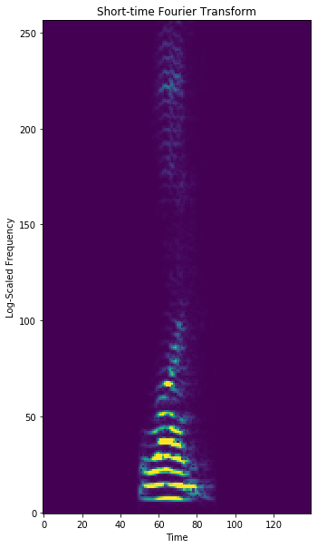

## Spoken GAN

We devleop a Generative Adversarial Network (GAN) to learn to "speak" the digits 0-9 from a small training set of audio samples.

The main trick here in the discriminator is to process the audio using the STFT (Short-Time Fourier Transform), and then use 2D convolutional layers to isolate features of this audio. The generator operates in reverse, using transposed 2D convolution, and then "inverting" the STFT to obtain an audio signal. 